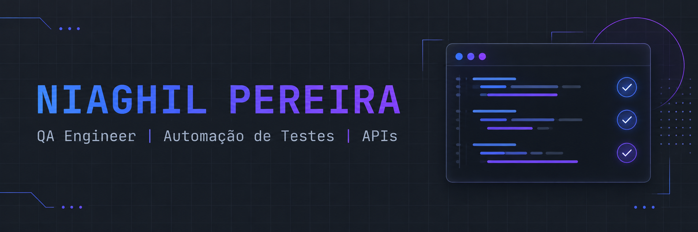

Olá! Seja bem-vindo ao meu perfil 👋

## Sobre mim

Trabalho com qualidade de software desde 2018, conectando análise técnica e entendimento das regras de negócio. Minha experiência em sistemas financeiros inclui validação de fluxos transacionais, integrações bancárias, mensagens ISO 8583 e testes de hardware e software em ATMs.

Tenho experiência em automação de testes com Cypress, incluindo a participação em projetos estruturados do zero, a criação e manutenção de testes e a ampliação da cobertura das validações. Também realizo testes de APIs REST com Postman, avaliando o comportamento das integrações e sua conformidade com as regras de negócio.

Tenho conhecimento em inteligência artificial e experiência com ferramentas como Lovable, Codex, Copilot e Claude. Já utilizei recursos de IA no desenvolvimento de sistemas de gestão de testes para uso interno na empresa em que atuo, combinando minha experiência em qualidade de software com a aplicação dessas ferramentas na construção de soluções.

Atualmente curso Ciência da Computação e sigo aprofundando meus conhecimentos em automação e IA aplicada à qualidade de software. Valorizo a documentação clara e o compartilhamento de conhecimento para facilitar a colaboração e a continuidade do trabalho da equipe.

## 🛠️ Tech Stack

<!-- Estilo escolhido: compacto e escuro. Fundo 252B37 e ícones coloridos. -->

 

 

Conhecimentos complementares em JMeter e atuação em ambientes de validação com Docker, Rancher e Kubernetes.

**Ferramentas de IA**

## Contatos

<!--
PERSONALIZE OS CONTATOS
1. Instagram configurado para @Niaghil_. Para mudar, edite o endereço do link.
2. Paleta escolhida: azul 2563EB, índigo 4F46E5 e roxo 7C3AED.
   Você pode substituí-los por outras cores hexadecimais, sem #.
3. style=for-the-badge mantém o formato retangular do exemplo.
-->

Canoas, RS, Brasil

<!--
INTEGRAÇÃO OPCIONAL
Cartão configurado para https://github.com/Niaghil.
Para exibi-lo, remova as linhas de abertura e fechamento deste comentário
e estas instruções.
O cartão depende do serviço externo GitHub Readme Stats.

## Atividade no GitHub

-->
